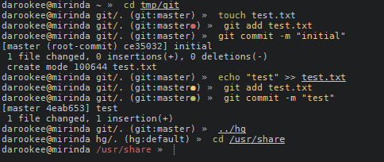

# Minimo

> Minimal and fast ZSH prompt



## Install

### [antigen](https://github.com/zsh-users/antigen)

Add `antigen bundle darookee/minimo` to your .zshrc file (do not use the `antigen theme` function).

#### Example

```sh
# .zshrc

antigen bundle darookee/minimo

autoload -U promptinit && promptinit
prompt minimo
```
